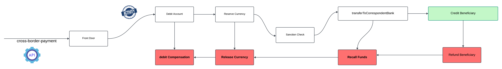

# BIAN Payment Implementation with Temporal

This project demonstrates the implementation of BIAN payment workflows using Temporal in Java.

##  BIAN Payment Processing
BIAN (Banking Industry Architecture Network) provides a framework for standardizing banking services. This project implements BIAN payment workflows using Temporal to ensure reliable and scalable payment processing.  
Key Components
PaymentActivity: Contains the activities related to payment processing, such as sending notifications and updating payment status.
PaymentWorkflow: Defines the workflow for processing payments, including validation, execution, and notification steps.
RefundWorkflow: Defines the workflow for processing refunds, ensuring that payments can be reversed if necessary.
Payment Workflow Steps
Validation: Validate the payment details, including debtor and creditor information.
Execution: Execute the payment by transferring funds from the debtor's account to the creditor's account.

## Submit Payment Scenario


## Cross Boarder Payment Scenario




## Project Structure

- **Languages and Frameworks**: Java, Gradle
- **Testing Framework**: JUnit 5 - Gatling
- **Workflow Engine**: Temporal

## Prerequisites

- Java 21
- Gradle
- Docker
- Helm

## Setting Up Temporal

To set up Temporal using the Helm chart, follow these steps:

1. Add the Temporal Helm repository:

    ```sh
    helm repo add temporal https://charts.temporal.io
    ```

2. Update your Helm repositories:

    ```sh
    helm repo update
    ```

3. Install the Temporal Helm chart:

    ```sh
    helm install temporaltest temporal/temporal
    ```


## Temporal , Kafka and API Stubs for Testing

To set up Kafka and mock API services for local development and testing, follow these steps:

docker-compose -f src/test/resources/compose/docker-compose.yml up -d

OR

gradle composeUp

The setup includes:

Apache Kafka with Zookeeper for message streaming

MockServer for simulating API responses during testing

Temporal for Integration testing


## Temporal Payment Processing Demos

I have prepared five demos using **Temporal** that showcase various payment processing scenarios. These demos cover both positive and negative cases, retry strategies, workflow recovery, cross-border payments, and scheduling with CronJobs. Check them out below:

1. **Positive Payment Processing (Customer Attended & Customer Unattended Scenarios)**  
   [](https://youtu.be/HSuteHF-af4)

2. **Negative Scenarios and Retries**  
   [](https://youtu.be/XxaHHrLEZQA)

3. **Payment Recovery with Workflow and Retry Capabilities**  
   [](https://youtu.be/YfEXa0u-Pek)

4. **Saga Pattern with Cross-Border Payments**  
   [](https://youtu.be/9lZHJyMEz78)

5. **CronJobs with Temporal**  
   [](https://youtu.be/VOf48J_0LZk)


### Building the Project

To build the project, run the following command:

```sh
./gradlew build


